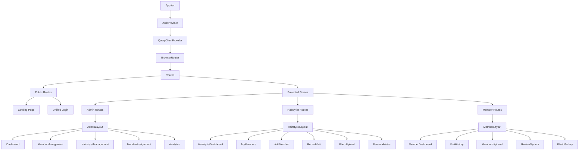
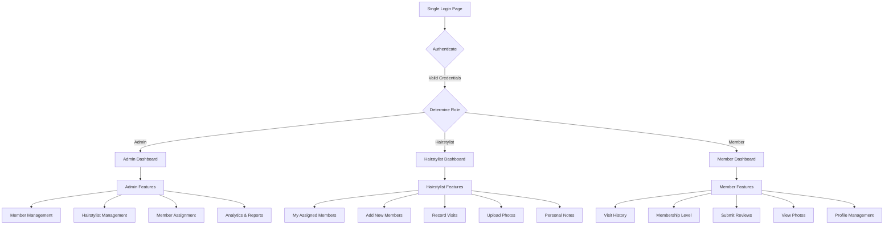
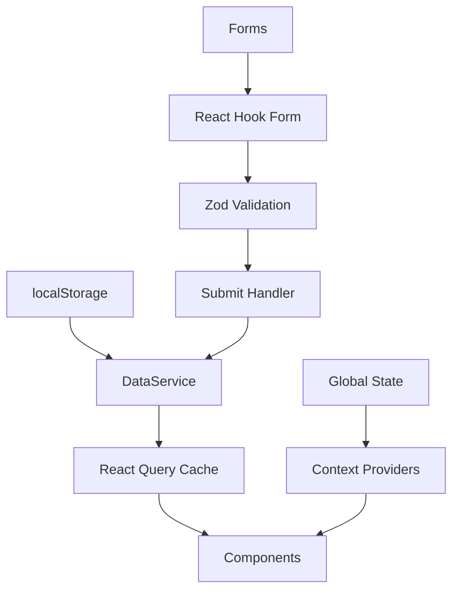
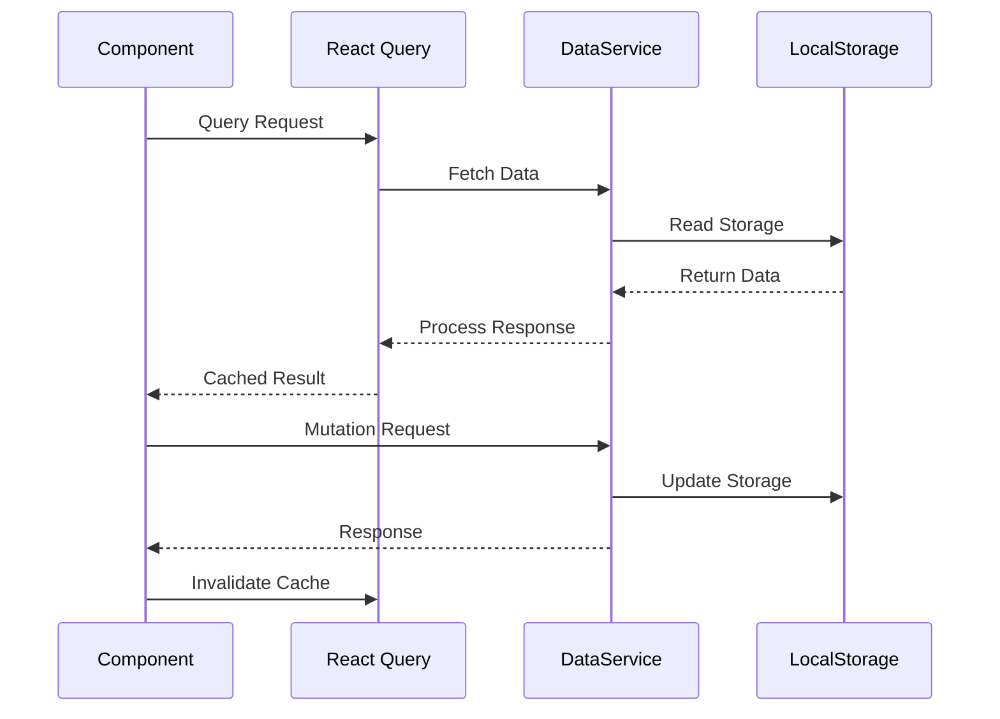
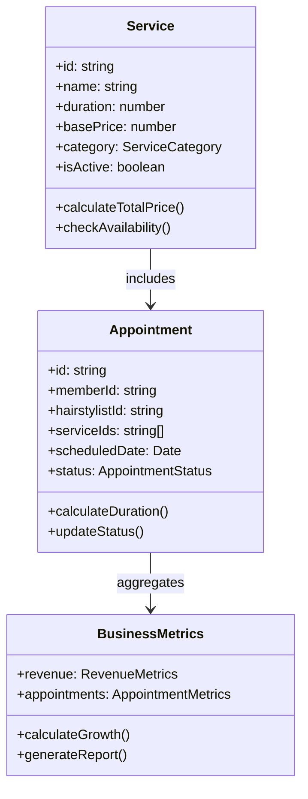

# Circle Keeper Dashboard - Hair Management System Design

## Overview

The Circle Keeper Dashboard is a comprehensive Hair Management System (HMS) built for Haijoel Men's Salon, featuring a multi-role web application that manages salon operations, member relationships, and business analytics. The system serves three distinct user types: administrators, hairstylists, and members, each with specialized interfaces and functionalities.

### Core Value Proposition
- **Exclusive Membership Management**: "The Circle" - A curated membership program with tiered leveling system
- **Multi-Role Access Control**: Unified login system with role-based dashboard routing
- **Comprehensive Visit Tracking**: Before/after photos, personal notes, and detailed visit history
- **Member-Hairstylist Assignment**: Flexible assignment system allowing multiple hairstylists per member
- **Interactive Feedback System**: Member reviews and comments for services, hairstylists, and barbershop
- **Progressive Membership Levels**: Gamified experience with rewards and recognition
- **Business Intelligence**: Comprehensive reporting and analytics for operational insights

## Technology Stack & Dependencies

### Frontend Framework
- **React 18.3.1** - Modern functional components with hooks
- **TypeScript 5.5.3** - Type-safe development with comprehensive interfaces
- **Vite 5.4.1** - Fast build tool with HMR support

### Backend & Database
- **Supabase** - PostgreSQL database with real-time subscriptions
- **Supabase Auth** - Authentication and authorization system
- **Supabase Storage** - File storage for before/after photos
- **Row Level Security (RLS)** - Database-level security policies

### UI/UX Libraries
- **shadcn-ui** - Component library built on Radix UI primitives
- **Tailwind CSS 3.4.11** - Utility-first styling framework
- **Lucide React** - Icon library for consistent visual elements
- **Radix UI Components** - Accessible, unstyled component primitives

### State Management & Data Flow
- **React Query (TanStack) 5.56.2** - Server state management with Supabase integration
- **React Hook Form 7.53.0** - Performant form handling with validation
- **Zod 3.23.8** - Schema validation and type inference
- **Supabase Client** - Real-time database and auth operations

### Routing & Navigation
- **React Router DOM 6.26.2** - Client-side routing with protected routes

## Component Architecture

### Enhanced Component Hierarchy



### Core Components Structure

#### Enhanced Layout Components
- **UnifiedAuthLayout** - Single login interface with role detection
- **AdminLayout** - Comprehensive admin navigation with member assignment tools
- **HairstylistLayout** - Specialized interface for member management and visit recording
- **MemberLayout** - Member-focused interface with membership progression

#### New Business Components

##### Admin Components
- **MemberAssignmentPanel** - Interface for assigning members to multiple hairstylists
- **HairstylistCreationForm** - Form for adding new hairstylists with specialties
- **MemberHairstylistMatrix** - Visual representation of member-hairstylist assignments
- **BusinessAnalyticsDashboard** - Comprehensive analytics with membership tier insights

##### Hairstylist Components
- **VisitRecordingForm** - Comprehensive form for logging visits with photos and notes
- **PhotoUploadComponent** - Before/after photo management with preview
- **PersonalNotesManager** - Private notes system for member preferences and history
- **MyMembersTable** - Enhanced table showing assigned members with quick actions
- **MemberHistoryPanel** - Detailed view of individual member visit history

##### Member Components
- **MembershipLevelCard** - Visual representation of current tier and progress
- **VisitHistoryTimeline** - Chronological display of visits with photos
- **ReviewSubmissionForm** - Multi-aspect rating system for services, hairstylists, and barbershop
- **PhotoGalleryViewer** - Before/after photo collection with privacy controls
- **MembershipProgressBar** - Animated progress indicator for next tier

##### Shared Components
- **RatingStarComponent** - Consistent 5-star rating input/display
- **PhotoViewerModal** - Full-screen photo viewer with zoom and navigation
- **MembershipBadge** - Visual tier indicator with colors and icons
- **FeedbackCard** - Standardized feedback display component

### Enhanced Component Definition Standards

```typescript
// Enhanced component interfaces with role-specific props
interface AdminComponentProps {
  data: DataType;
  onAssignMember: (memberId: string, hairstylistIds: string[]) => void;
  onCreateHairstylist: (data: HairstylistFormData) => void;
  permissions: AdminPermission[];
  className?: string;
}

interface HairstylistComponentProps {
  hairstylistId: string;
  assignedMembers: Member[];
  onRecordVisit: (visitData: VisitRecordData) => void;
  onUploadPhotos: (photos: File[], visitId: string) => void;
  onAddNote: (note: PersonalNoteData) => void;
  className?: string;
}

interface MemberComponentProps {
  memberId: string;
  visitHistory: VisitRecord[];
  membershipLevel: MembershipTier;
  onSubmitReview: (review: ReviewData) => void;
  onUpdateProfile: (profile: MemberProfile) => void;
  className?: string;
}

// Component composition pattern for enhanced reusability
const EnhancedMemberCard: React.FC<{
  member: Member;
  variant: 'admin' | 'hairstylist' | 'member';
  actions?: React.ReactNode;
}> = ({ member, variant, actions }) => {
  const memberProfile = member.profile as MemberProfile;
  const membershipTier = MembershipCalculator.calculateLevel(
    memberProfile.totalVisits || 0,
    memberProfile.membershipPoints || 0
  );
  
  return (
    <Card className="member-card">
      <CardHeader>
        <div className="flex items-center justify-between">
          <div className="flex items-center space-x-3">
            <Avatar>
              <AvatarFallback>{member.profile.fullName[0]}</AvatarFallback>
            </Avatar>
            <div>
              <CardTitle>{member.profile.fullName}</CardTitle>
              <CardDescription>
                {variant === 'admin' && `Assigned to ${memberProfile.assignedHairstylists?.length || 0} hairstylists`}
                {variant === 'hairstylist' && `${memberProfile.totalVisits || 0} visits`}
                {variant === 'member' && `Member since ${memberProfile.joinDate}`}
              </CardDescription>
            </div>
          </div>
          <MembershipBadge tier={membershipTier} />
        </div>
      </CardHeader>
      <CardContent>
        {variant === 'admin' && (
          <AdminMemberDetails member={member} />
        )}
        {variant === 'hairstylist' && (
          <HairstylistMemberDetails member={member} />
        )}
        {variant === 'member' && (
          <MemberSelfDetails member={member} />
        )}
        {actions && <div className="mt-4">{actions}</div>}
      </CardContent>
    </Card>
  );
};
```

### State Management Patterns for Enhanced Features

#### Supabase Integration Hooks
```typescript
// Custom hook for Supabase authentication
const useSupabaseAuth = () => {
  const [user, setUser] = useState<User | null>(null);
  const [userProfile, setUserProfile] = useState<UserProfile | null>(null);
  const [loading, setLoading] = useState(true);
  
  useEffect(() => {
    // Get initial session
    supabase.auth.getSession().then(({ data: { session } }) => {
      setUser(session?.user ?? null);
      if (session?.user) {
        fetchUserProfile(session.user.id);
      } else {
        setLoading(false);
      }
    });
    
    // Listen for auth changes
    const { data: { subscription } } = supabase.auth.onAuthStateChange(
      async (event, session) => {
        setUser(session?.user ?? null);
        if (session?.user) {
          await fetchUserProfile(session.user.id);
        } else {
          setUserProfile(null);
          setLoading(false);
        }
      }
    );
    
    return () => subscription.unsubscribe();
  }, []);
  
  const fetchUserProfile = async (userId: string) => {
    try {
      const { data, error } = await supabase
        .from('user_profiles')
        .select('*')
        .eq('id', userId)
        .single();
      
      if (error) throw error;
      setUserProfile(data);
    } catch (error) {
      console.error('Error fetching user profile:', error);
    } finally {
      setLoading(false);
    }
  };
  
  const signIn = async (email: string, password: string) => {
    const { data, error } = await supabase.auth.signInWithPassword({
      email,
      password
    });
    
    if (error) throw error;
    return data;
  };
  
  const signOut = async () => {
    const { error } = await supabase.auth.signOut();
    if (error) throw error;
  };
  
  return {
    user,
    userProfile,
    loading,
    signIn,
    signOut,
    isAuthenticated: !!user,
    isAdmin: userProfile?.role === 'admin',
    isHairstylist: userProfile?.role === 'hairstylist',
    isMember: userProfile?.role === 'member'
  };
};

// Real-time visits subscription
const useVisitsSubscription = (memberId?: string, hairstylistId?: string) => {
  const [visits, setVisits] = useState<Visit[]>([]);
  const [loading, setLoading] = useState(true);
  
  useEffect(() => {
    let query = supabase
      .from('visits')
      .select(`
        *,
        visit_services(*, services(*)),
        visit_photos(*),
        members(full_name, whatsapp_number),
        hairstylists(full_name)
      `);
    
    if (memberId) {
      query = query.eq('member_id', memberId);
    }
    if (hairstylistId) {
      query = query.eq('hairstylist_id', hairstylistId);
    }
    
    // Initial fetch
    query
      .order('visit_date', { ascending: false })
      .then(({ data, error }) => {
        if (error) {
          console.error('Error fetching visits:', error);
        } else {
          setVisits(data || []);
        }
        setLoading(false);
      });
    
    // Subscribe to real-time changes
    const subscription = supabase
      .channel('visits_changes')
      .on(
        'postgres_changes',
        {
          event: '*',
          schema: 'public',
          table: 'visits',
          filter: memberId ? `member_id=eq.${memberId}` : 
                 hairstylistId ? `hairstylist_id=eq.${hairstylistId}` : undefined
        },
        (payload) => {
          if (payload.eventType === 'INSERT') {
            // Fetch the new visit with related data
            supabase
              .from('visits')
              .select(`
                *,
                visit_services(*, services(*)),
                visit_photos(*),
                members(full_name, whatsapp_number),
                hairstylists(full_name)
              `)
              .eq('id', payload.new.id)
              .single()
              .then(({ data }) => {
                if (data) {
                  setVisits(prev => [data, ...prev]);
                }
              });
          } else if (payload.eventType === 'UPDATE') {
            setVisits(prev => 
              prev.map(visit => 
                visit.id === payload.new.id 
                  ? { ...visit, ...payload.new }
                  : visit
              )
            );
          } else if (payload.eventType === 'DELETE') {
            setVisits(prev => 
              prev.filter(visit => visit.id !== payload.old.id)
            );
          }
        }
      )
      .subscribe();
    
    return () => {
      subscription.unsubscribe();
    };
  }, [memberId, hairstylistId]);
  
  return { visits, loading };
};
```

#### Enhanced Visit Recording with Multiple Services
```typescript
// Multi-service visit recording hook
const useMultiServiceVisitRecording = (memberId: string, hairstylistId: string) => {
  const [selectedServices, setSelectedServices] = useState<string[]>([]);
  const [visitData, setVisitData] = useState<VisitRecordingState>({
    beforePhotos: [],
    afterPhotos: [],
    hairstylistNotes: '',
    personalNotes: '',
    discountPercentage: 0
  });
  
  const [uploadProgress, setUploadProgress] = useState<Record<string, number>>({});
  const { userProfile } = useSupabaseAuth();
  
  // Calculate pricing and duration based on selected services
  const pricing = useMemo(() => {
    const validation = ServiceManager.validateServiceCombination(selectedServices);
    const totalPrice = ServiceManager.calculateTotalPrice(selectedServices, visitData.discountPercentage);
    const totalDuration = ServiceManager.calculateTotalDuration(selectedServices);
    
    return {
      totalPrice,
      totalDuration,
      validation,
      services: selectedServices.map(id => ServiceManager.getServiceById(id)).filter(Boolean)
    };
  }, [selectedServices, visitData.discountPercentage]);
  
  // Upload photos to Supabase Storage
  const uploadPhotos = async (files: File[], type: 'before' | 'after', visitId: string) => {
    const uploadPromises = files.map(async (file, index) => {
      const fileExt = file.name.split('.').pop();
      const fileName = `${visitId}/${type}/${Date.now()}_${index}.${fileExt}`;
      
      try {
        setUploadProgress(prev => ({ ...prev, [fileName]: 0 }));
        
        const { data, error } = await supabase.storage
          .from('visit-photos')
          .upload(fileName, file, {
            onUploadProgress: (progress) => {
              const percentage = (progress.loaded / progress.total) * 100;
              setUploadProgress(prev => ({ ...prev, [fileName]: percentage }));
            }
          });
        
        if (error) throw error;
        
        // Get public URL
        const { data: { publicUrl } } = supabase.storage
          .from('visit-photos')
          .getPublicUrl(fileName);
        
        // Save photo record to database
        const { data: photoRecord, error: photoError } = await supabase
          .from('visit_photos')
          .insert({
            visit_id: visitId,
            photo_type: type,
            file_path: fileName,
            file_url: publicUrl,
            uploaded_by: userProfile?.id,
            description: file.name,
            is_public: false
          })
          .select()
          .single();
        
        if (photoError) throw photoError;
        
        setUploadProgress(prev => {
          const newProgress = { ...prev };
          delete newProgress[fileName];
          return newProgress;
        });
        
        return photoRecord;
      } catch (error) {
        console.error(`Error uploading ${fileName}:`, error);
        setUploadProgress(prev => {
          const newProgress = { ...prev };
          delete newProgress[fileName];
          return newProgress;
        });
        throw error;
      }
    });
    
    return Promise.all(uploadPromises);
  };
  
  // Record visit with multiple services
  const recordVisit = useMutation({
    mutationFn: async (data: VisitRecordingState & { selectedServices: string[] }) => {
      if (data.selectedServices.length === 0) {
        throw new Error('At least one service must be selected');
      }
      
      // Validate service combination
      const validation = ServiceManager.validateServiceCombination(data.selectedServices);
      if (!validation.isValid) {
        throw new Error(`Service combination invalid: ${validation.conflicts.join(', ')}`);
      }
      
      // Calculate member's membership level for discount
      const { data: memberData } = await supabase
        .from('members')
        .select('membership_level, total_visits, membership_points')
        .eq('id', memberId)
        .single();
      
      if (!memberData) throw new Error('Member not found');
      
      const membershipTier = MembershipCalculator.calculateLevel(
        memberData.total_visits,
        memberData.membership_points
      );
      
      // Apply membership discount
      const finalDiscount = Math.max(data.discountPercentage, membershipTier.discountPercentage);
      const totalPrice = ServiceManager.calculateTotalPrice(data.selectedServices, finalDiscount);
      const totalDuration = ServiceManager.calculateTotalDuration(data.selectedServices);
      
      // Calculate membership points earned
      const pointsEarned = MembershipCalculator.calculatePoints({
        totalPrice,
        serviceIds: data.selectedServices
      } as Visit, data.selectedServices.map(id => ServiceManager.getServiceById(id)!));
      
      // Create visit record
      const { data: visit, error: visitError } = await supabase
        .from('visits')
        .insert({
          member_id: memberId,
          hairstylist_id: hairstylistId,
          total_duration: totalDuration,
          total_price: totalPrice,
          hairstylist_notes: data.hairstylistNotes,
          personal_notes: data.personalNotes,
          membership_points_earned: pointsEarned,
          membership_tier_at_visit: membershipTier.id
        })
        .select()
        .single();
      
      if (visitError) throw visitError;
      
      // Create visit_services records
      const serviceRecords = data.selectedServices.map(serviceId => {
        const service = ServiceManager.getServiceById(serviceId)!;
        const discountedPrice = service.basePrice * (1 - finalDiscount / 100);
        
        return {
          visit_id: visit.id,
          service_id: serviceId,
          price_paid: discountedPrice
        };
      });
      
      const { error: servicesError } = await supabase
        .from('visit_services')
        .insert(serviceRecords);
      
      if (servicesError) throw servicesError;
      
      // Upload photos if any
      if (data.beforePhotos.length > 0) {
        await uploadPhotos(data.beforePhotos, 'before', visit.id);
      }
      
      if (data.afterPhotos.length > 0) {
        await uploadPhotos(data.afterPhotos, 'after', visit.id);
      }
      
      // Update member stats
      const newTotalVisits = memberData.total_visits + 1;
      const newTotalPoints = memberData.membership_points + pointsEarned;
      const newMembershipLevel = MembershipCalculator.calculateLevel(newTotalVisits, newTotalPoints);
      
      const { error: memberUpdateError } = await supabase
        .from('members')
        .update({
          total_visits: newTotalVisits,
          membership_points: newTotalPoints,
          membership_level: newMembershipLevel.id
        })
        .eq('id', memberId);
      
      if (memberUpdateError) throw memberUpdateError;
      
      // Save personal note if provided
      if (data.personalNotes) {
        await supabase
          .from('member_notes')
          .insert({
            member_id: memberId,
            hairstylist_id: hairstylistId,
            content: data.personalNotes,
            category: 'personal',
            is_private: true
          });
      }
      
      return visit;
    },
    onSuccess: (visit) => {
      toast.success('Visit recorded successfully!');
      
      // Show membership upgrade notification if applicable
      if (visit.membership_tier_at_visit !== memberData?.membership_level) {
        const newTier = MembershipCalculator.getTierById(visit.membership_tier_at_visit!);
        toast.success(`🎉 Member upgraded to ${newTier?.displayName}!`, {
          duration: 5000
        });
      }
      
      // Reset form
      setSelectedServices([]);
      setVisitData({
        beforePhotos: [],
        afterPhotos: [],
        hairstylistNotes: '',
        personalNotes: '',
        discountPercentage: 0
      });
      
      queryClient.invalidateQueries(['visits', memberId]);
      queryClient.invalidateQueries(['member-stats', memberId]);
    },
    onError: (error) => {
      toast.error(`Failed to record visit: ${error.message}`);
    }
  });
  
  return {
    selectedServices,
    setSelectedServices,
    visitData,
    setVisitData,
    pricing,
    uploadProgress,
    recordVisit,
    isRecording: recordVisit.isPending
  };
};
```

#### Membership Progress State
```typescript
// Real-time membership calculation
const useMembershipProgress = (memberId: string) => {
  const { data: membershipDetails } = useQuery({
    queryKey: ['membership-details', memberId],
    queryFn: () => dataService.getMembershipDetails(memberId),
    refetchInterval: 30000 // Refresh every 30 seconds
  });
  
  const [animatedProgress, setAnimatedProgress] = useState(0);
  
  useEffect(() => {
    if (membershipDetails?.progress.overallProgress) {
      const timer = setTimeout(() => {
        setAnimatedProgress(membershipDetails.progress.overallProgress);
      }, 100);
      return () => clearTimeout(timer);
    }
  }, [membershipDetails]);
  
  return {
    ...membershipDetails,
    animatedProgress,
    isMaxLevel: !membershipDetails?.nextTier
  };
};
```

#### Photo Management State
```typescript
// Advanced photo upload and management
const usePhotoManagement = () => {
  const [photos, setPhotos] = useState<{
    before: File[];
    after: File[];
  }>({ before: [], after: [] });
  
  const [previews, setPreviews] = useState<{
    before: string[];
    after: string[];
  }>({ before: [], after: [] });
  
  const addPhotos = useCallback((type: 'before' | 'after', files: File[]) => {
    setPhotos(prev => ({
      ...prev,
      [type]: [...prev[type], ...files]
    }));
    
    // Generate previews
    const newPreviews = files.map(file => URL.createObjectURL(file));
    setPreviews(prev => ({
      ...prev,
      [type]: [...prev[type], ...newPreviews]
    }));
  }, []);
  
  const removePhoto = useCallback((type: 'before' | 'after', index: number) => {
    setPhotos(prev => ({
      ...prev,
      [type]: prev[type].filter((_, i) => i !== index)
    }));
    
    setPreviews(prev => {
      // Revoke object URL to prevent memory leaks
      URL.revokeObjectURL(prev[type][index]);
      return {
        ...prev,
        [type]: prev[type].filter((_, i) => i !== index)
      };
    });
  }, []);
  
  // Cleanup on unmount
  useEffect(() => {
    return () => {
      [...previews.before, ...previews.after].forEach(url => {
        URL.revokeObjectURL(url);
      });
    };
  }, []);
  
  return {
    photos,
    previews,
    addPhotos,
    removePhoto,
    totalPhotos: photos.before.length + photos.after.length
  };
};
```

## Routing & Navigation

### Unified Authentication System



### Enhanced Route Structure

```typescript
// Unified login with role-based routing
interface LoginCredentials {
  email: string;
  password: string;
  role?: 'admin' | 'hairstylist' | 'member'; // Optional role selection
}

// Post-login routing logic
const handleLoginSuccess = (user: User) => {
  switch (user.role) {
    case 'admin':
      navigate('/admin/dashboard');
      break;
    case 'hairstylist':
      navigate('/hairstylist/dashboard');
      break;
    case 'member':
      navigate('/member/dashboard');
      break;
    default:
      navigate('/login');
  }
};
```

### Route Hierarchy

```mermaid
graph TD
    A[/] --> B[Landing Page]
    C[/login] --> D[Unified Login]
    
    E[/admin] --> F[Admin Layout]
    F --> G[/dashboard - Admin Overview]
    F --> H[/members - Member Management]
    F --> I[/members/add - Add Member]
    F --> J[/members/:id/assign - Assign Hairstylists]
    F --> K[/hairstylists - Hairstylist Management]
    F --> L[/analytics - Business Analytics]
    F --> M[/settings - System Settings]
    
    N[/hairstylist] --> O[Hairstylist Layout]
    O --> P[/dashboard - My Overview]
    O --> Q[/my-members - Assigned Members]
    O --> R[/members/add - Add New Member]
    O --> S[/visits/record - Record Visit]
    O --> T[/members/:id/notes - Personal Notes]
    O --> U[/members/:id/history - Member History]
    
    V[/member] --> W[Member Layout]
    W --> X[/dashboard - Member Overview]
    W --> Y[/visits - Visit History]
    W --> Z[/membership - Membership Level]
    W --> AA[/reviews - Submit Reviews]
    W --> BB[/profile - Profile Management]
```

### Enhanced Protected Route Implementation

```typescript
// Unified authentication with role detection
const useAuth = () => {
  const [user, setUser] = useState<User | null>(null);
  const [loading, setLoading] = useState(true);
  
  useEffect(() => {
    const token = localStorage.getItem('hms_auth_token');
    const userData = localStorage.getItem('hms_user_data');
    
    if (token && userData) {
      try {
        const parsedUser = JSON.parse(userData);
        setUser(parsedUser);
      } catch (error) {
        localStorage.removeItem('hms_auth_token');
        localStorage.removeItem('hms_user_data');
      }
    }
    setLoading(false);
  }, []);
  
  return { user, loading, setUser };
};

// Role-based route protection
const ProtectedRoute = ({ 
  children, 
  requiredRole 
}: { 
  children: React.ReactNode;
  requiredRole?: 'admin' | 'hairstylist' | 'member';
}) => {
  const { user, loading } = useAuth();
  
  if (loading) {
    return <div className="flex items-center justify-center min-h-screen">
      <div className="animate-spin rounded-full h-32 w-32 border-b-2 border-primary"></div>
    </div>;
  }
  
  if (!user) {
    return <Navigate to="/login" replace />;
  }
  
  if (requiredRole && user.role !== requiredRole) {
    return <Navigate to="/unauthorized" replace />;
  }
  
  return <>{children}</>;
};
```

## Styling Strategy

### Tailwind CSS Configuration
- **Design System**: Custom color palette with HMS branding
- **Responsive Design**: Mobile-first approach with breakpoint utilities
- **Component Variants**: Class variance authority for component styling
- **Animation**: tailwindcss-animate for smooth transitions

### Key Design Principles
- **Consistency**: Uniform spacing, typography, and color usage
- **Accessibility**: ARIA labels, keyboard navigation, color contrast
- **Responsive**: Mobile-first design with tablet and desktop optimizations
- **Performance**: Optimized CSS bundle with unused style purging

## State Management

### Data Architecture



### Enhanced DataService Architecture with Supabase

```typescript
class SupabaseDataService {
  private supabase: SupabaseClient;
  
  constructor() {
    this.supabase = createClient(
      process.env.VITE_SUPABASE_URL!,
      process.env.VITE_SUPABASE_ANON_KEY!
    );
  }
  
  // =================== AUTHENTICATION ===================
  
  async signIn(email: string, password: string): Promise<ApiResponse<AuthUser>> {
    try {
      const { data, error } = await this.supabase.auth.signInWithPassword({
        email,
        password
      });
      
      if (error) throw error;
      
      // Fetch user profile
      const { data: profile, error: profileError } = await this.supabase
        .from('user_profiles')
        .select('*')
        .eq('id', data.user.id)
        .single();
      
      if (profileError) throw profileError;
      
      return {
        success: true,
        data: { ...data.user, profile },
        message: 'Login successful'
      };
    } catch (error) {
      return {
        success: false,
        message: error.message || 'Login failed'
      };
    }
  }
  
  async signOut(): Promise<ApiResponse<boolean>> {
    try {
      const { error } = await this.supabase.auth.signOut();
      if (error) throw error;
      
      return {
        success: true,
        data: true,
        message: 'Logged out successfully'
      };
    } catch (error) {
      return {
        success: false,
        message: error.message || 'Logout failed'
      };
    }
  }
  
  // =================== ADMIN OPERATIONS ===================
  
  async createMemberWithAssignment(
    memberData: MemberFormData, 
    hairstylistIds: string[]
  ): Promise<ApiResponse<Member>> {
    try {
      // Create auth user first
      const tempPassword = this.generateTempPassword();
      const memberEmail = `${memberData.whatsappNumber.replace(/\D/g, '')}@member.hms`;
      
      const { data: authData, error: authError } = await this.supabase.auth.admin.createUser({
        email: memberEmail,
        password: tempPassword,
        email_confirm: true
      });
      
      if (authError) throw authError;
      
      // Create user profile
      const { data: profile, error: profileError } = await this.supabase
        .from('user_profiles')
        .insert({
          id: authData.user.id,
          email: memberEmail,
          role: 'member',
          full_name: memberData.fullName,
          phone: memberData.whatsappNumber
        })
        .select()
        .single();
      
      if (profileError) throw profileError;
      
      // Create member record
      const { data: member, error: memberError } = await this.supabase
        .from('members')
        .insert({
          id: authData.user.id,
          whatsapp_number: memberData.whatsappNumber,
          instagram_handle: memberData.instagramHandle,
          preferences: memberData.preferences || {}
        })
        .select()
        .single();
      
      if (memberError) throw memberError;
      
      // Create assignments
      if (hairstylistIds.length > 0) {
        const assignments = hairstylistIds.map(hairstylistId => ({
          member_id: authData.user.id,
          hairstylist_id: hairstylistId,
          assigned_by: (await this.supabase.auth.getUser()).data.user?.id
        }));
        
        const { error: assignmentError } = await this.supabase
          .from('member_assignments')
          .insert(assignments);
        
        if (assignmentError) throw assignmentError;
      }
      
      return {
        success: true,
        data: { ...member, profile },
        message: 'Member created and assigned successfully'
      };
    } catch (error) {
      return {
        success: false,
        message: error.message || 'Failed to create member'
      };
    }
  }
  
  async createHairstylist(hairstylistData: HairstylistFormData): Promise<ApiResponse<Hairstylist>> {
    try {
      // Create auth user
      const tempPassword = this.generateTempPassword();
      
      const { data: authData, error: authError } = await this.supabase.auth.admin.createUser({
        email: hairstylistData.email,
        password: tempPassword,
        email_confirm: true
      });
      
      if (authError) throw authError;
      
      // Create user profile
      const { data: profile, error: profileError } = await this.supabase
        .from('user_profiles')
        .insert({
          id: authData.user.id,
          email: hairstylistData.email,
          role: 'hairstylist',
          full_name: hairstylistData.fullName,
          phone: hairstylistData.phone
        })
        .select()
        .single();
      
      if (profileError) throw profileError;
      
      // Create hairstylist record
      const { data: hairstylist, error: hairstylistError } = await this.supabase
        .from('hairstylists')
        .insert({
          id: authData.user.id,
          specialties: hairstylistData.specialties.split(',').map(s => s.trim()),
          experience: hairstylistData.experience,
          address: hairstylistData.address,
          bio: hairstylistData.bio,
          stats: {
            totalClients: 0,
            monthlyClients: 0,
            totalRevenue: 0,
            averageRating: 0,
            totalAppointments: 0
          }
        })
        .select()
        .single();
      
      if (hairstylistError) throw hairstylistError;
      
      return {
        success: true,
        data: { ...hairstylist, profile },
        message: 'Hairstylist created successfully'
      };
    } catch (error) {
      return {
        success: false,
        message: error.message || 'Failed to create hairstylist'
      };
    }
  }
  
  // =================== HAIRSTYLIST OPERATIONS ===================
  
  async recordVisitWithServices(
    visitData: {
      memberId: string;
      hairstylistId: string;
      serviceIds: string[];
      beforePhotos: File[];
      afterPhotos: File[];
      hairstylistNotes: string;
      personalNotes: string;
      discountPercentage?: number;
    }
  ): Promise<ApiResponse<Visit>> {
    try {
      // Validate services
      const validation = ServiceManager.validateServiceCombination(visitData.serviceIds);
      if (!validation.isValid) {
        return {
          success: false,
          message: `Invalid service combination: ${validation.conflicts.join(', ')}`
        };
      }
      
      // Get member data for membership calculations
      const { data: memberData, error: memberError } = await this.supabase
        .from('members')
        .select('membership_level, total_visits, membership_points')
        .eq('id', visitData.memberId)
        .single();
      
      if (memberError) throw memberError;
      
      // Calculate pricing with membership discount
      const membershipTier = MembershipCalculator.calculateLevel(
        memberData.total_visits,
        memberData.membership_points
      );
      
      const finalDiscount = Math.max(
        visitData.discountPercentage || 0,
        membershipTier.discountPercentage
      );
      
      const totalPrice = ServiceManager.calculateTotalPrice(visitData.serviceIds, finalDiscount);
      const totalDuration = ServiceManager.calculateTotalDuration(visitData.serviceIds);
      
      // Calculate points earned
      const pointsEarned = MembershipCalculator.calculatePoints(
        { totalPrice, serviceIds: visitData.serviceIds } as Visit,
        visitData.serviceIds.map(id => ServiceManager.getServiceById(id)!)
      );
      
      // Create visit record
      const { data: visit, error: visitError } = await this.supabase
        .from('visits')
        .insert({
          member_id: visitData.memberId,
          hairstylist_id: visitData.hairstylistId,
          total_duration: totalDuration,
          total_price: totalPrice,
          hairstylist_notes: visitData.hairstylistNotes,
          personal_notes: visitData.personalNotes,
          membership_points_earned: pointsEarned,
          membership_tier_at_visit: membershipTier.id
        })
        .select()
        .single();
      
      if (visitError) throw visitError;
      
      // Create service records
      const serviceRecords = visitData.serviceIds.map(serviceId => {
        const service = ServiceManager.getServiceById(serviceId)!;
        const discountedPrice = service.basePrice * (1 - finalDiscount / 100);
        
        return {
          visit_id: visit.id,
          service_id: serviceId,
          price_paid: discountedPrice
        };
      });
      
      const { error: servicesError } = await this.supabase
        .from('visit_services')
        .insert(serviceRecords);
      
      if (servicesError) throw servicesError;
      
      // Upload photos
      await this.uploadVisitPhotos(visit.id, visitData.beforePhotos, 'before', visitData.hairstylistId);
      await this.uploadVisitPhotos(visit.id, visitData.afterPhotos, 'after', visitData.hairstylistId);
      
      // Update member statistics
      const newTotalVisits = memberData.total_visits + 1;
      const newTotalPoints = memberData.membership_points + pointsEarned;
      const newMembershipLevel = MembershipCalculator.calculateLevel(newTotalVisits, newTotalPoints);
      
      const { error: memberUpdateError } = await this.supabase
        .from('members')
        .update({
          total_visits: newTotalVisits,
          membership_points: newTotalPoints,
          membership_level: newMembershipLevel.id
        })
        .eq('id', visitData.memberId);
      
      if (memberUpdateError) throw memberUpdateError;
      
      // Save personal note if provided
      if (visitData.personalNotes) {
        await this.addPersonalNote({
          memberId: visitData.memberId,
          hairstylistId: visitData.hairstylistId,
          content: visitData.personalNotes,
          category: 'personal',
          isPrivate: true
        });
      }
      
      return {
        success: true,
        data: visit,
        message: 'Visit recorded successfully'
      };
    } catch (error) {
      return {
        success: false,
        message: error.message || 'Failed to record visit'
      };
    }
  }
  
  async getAssignedMembers(hairstylistId: string): Promise<Member[]> {
    const { data, error } = await this.supabase
      .from('member_assignments')
      .select(`
        members!inner(*,
          user_profiles!inner(full_name, email, phone)
        )
      `)
      .eq('hairstylist_id', hairstylistId)
      .eq('is_active', true);
    
    if (error) {
      console.error('Error fetching assigned members:', error);
      return [];
    }
    
    return data?.map(assignment => assignment.members) || [];
  }
  
  async addPersonalNote(noteData: {
    memberId: string;
    hairstylistId: string;
    content: string;
    category: string;
    isPrivate: boolean;
  }): Promise<ApiResponse<MemberNote>> {
    try {
      const { data, error } = await this.supabase
        .from('member_notes')
        .insert({
          member_id: noteData.memberId,
          hairstylist_id: noteData.hairstylistId,
          content: noteData.content,
          category: noteData.category,
          is_private: noteData.isPrivate
        })
        .select()
        .single();
      
      if (error) throw error;
      
      return {
        success: true,
        data,
        message: 'Note added successfully'
      };
    } catch (error) {
      return {
        success: false,
        message: error.message || 'Failed to add note'
      };
    }
  }
  
  // =================== MEMBER OPERATIONS ===================
  
  async getMemberVisitHistory(memberId: string): Promise<Visit[]> {
    const { data, error } = await this.supabase
      .from('visits')
      .select(`
        *,
        visit_services(*, services(*)),
        visit_photos(*),
        hairstylists(full_name, specialties)
      `)
      .eq('member_id', memberId)
      .order('visit_date', { ascending: false });
    
    if (error) {
      console.error('Error fetching visit history:', error);
      return [];
    }
    
    return data || [];
  }
  
  async submitMemberFeedback(feedbackData: Omit<MemberFeedback, 'id' | 'submittedAt'>): Promise<ApiResponse<MemberFeedback>> {
    try {
      const { data, error } = await this.supabase
        .from('member_feedback')
        .insert(feedbackData)
        .select()
        .single();
      
      if (error) throw error;
      
      // Update visit with ratings
      const { error: visitUpdateError } = await this.supabase
        .from('visits')
        .update({
          service_rating: feedbackData.serviceRating,
          hairstylist_rating: feedbackData.hairstylistRating,
          barbershop_rating: feedbackData.barbershopRating,
          member_comment: feedbackData.serviceComment
        })
        .eq('id', feedbackData.visitId);
      
      if (visitUpdateError) throw visitUpdateError;
      
      return {
        success: true,
        data,
        message: 'Feedback submitted successfully'
      };
    } catch (error) {
      return {
        success: false,
        message: error.message || 'Failed to submit feedback'
      };
    }
  }
  
  // =================== UTILITY OPERATIONS ===================
  
  private async uploadVisitPhotos(
    visitId: string, 
    files: File[], 
    type: 'before' | 'after',
    uploadedBy: string
  ): Promise<void> {
    if (files.length === 0) return;
    
    const uploadPromises = files.map(async (file, index) => {
      const fileExt = file.name.split('.').pop();
      const fileName = `${visitId}/${type}/${Date.now()}_${index}.${fileExt}`;
      
      // Upload to storage
      const { data: uploadData, error: uploadError } = await this.supabase.storage
        .from('visit-photos')
        .upload(fileName, file);
      
      if (uploadError) throw uploadError;
      
      // Get public URL
      const { data: { publicUrl } } = this.supabase.storage
        .from('visit-photos')
        .getPublicUrl(fileName);
      
      // Save photo record
      const { error: photoError } = await this.supabase
        .from('visit_photos')
        .insert({
          visit_id: visitId,
          photo_type: type,
          file_path: fileName,
          file_url: publicUrl,
          uploaded_by: uploadedBy,
          description: file.name,
          is_public: false
        });
      
      if (photoError) throw photoError;
    });
    
    await Promise.all(uploadPromises);
  }
  
  private generateTempPassword(): string {
    return Math.random().toString(36).slice(-8) + Math.random().toString(36).slice(-8);
  }
  
  async getServices(): Promise<Service[]> {
    // Return hardcoded services with database IDs if they exist
    const { data: dbServices } = await this.supabase
      .from('services')
      .select('*')
      .eq('is_active', true);
    
    // If no services in DB, return hardcoded services
    if (!dbServices || dbServices.length === 0) {
      return HMS_SERVICES.map(service => ({
        ...service,
        id: service.id // Use hardcoded ID as UUID
      }));
    }
    
    return dbServices;
  }
  
  // Initialize default services in database
  async initializeServices(): Promise<void> {
    try {
      const { data: existingServices } = await this.supabase
        .from('services')
        .select('id')
        .limit(1);
      
      if (existingServices && existingServices.length > 0) {
        return; // Services already initialized
      }
      
      const serviceRecords = HMS_SERVICES.map(service => ({
        id: service.id,
        name: service.name,
        description: service.description,
        base_price: service.basePrice,
        duration_minutes: service.duration,
        category: service.category,
        is_combo: service.isCombo,
        combo_services: service.comboServices,
        is_active: service.isActive
      }));
      
      const { error } = await this.supabase
        .from('services')
        .insert(serviceRecords);
      
      if (error) {
        console.error('Error initializing services:', error);
      }
    } catch (error) {
      console.error('Error initializing services:', error);
    }
  }
}

// Export singleton instance
export const supabaseDataService = new SupabaseDataService();
```

### State Persistence Strategy
- **Local Storage**: Primary data persistence for offline capability
- **Session Storage**: Temporary authentication tokens
- **Memory Cache**: React Query for optimized re-fetching
- **Form State**: React Hook Form for complex form management

## API Integration Layer

### Data Service Pattern

```typescript
// Centralized API response handling
interface ApiResponse<T> {
  success: boolean;
  data?: T;
  message?: string;
  errors?: string[];
}

// Consistent error handling
const handleApiResponse = <T>(response: ApiResponse<T>) => {
  if (response.success) {
    toast.success(response.message);
    return response.data;
  } else {
    toast.error(response.message || 'Operation failed');
    throw new Error(response.message);
  }
};
```

### Data Flow Architecture



## Testing Strategy

### Enhanced Testing Framework

#### Component Testing with Enhanced Features
```typescript
// Testing visit recording component
describe('VisitRecordingForm', () => {
  const mockHairstylist = {
    id: 'hairstylist-1',
    role: 'hairstylist' as const,
    profile: { fullName: 'John Stylist' }
  };
  
  const mockMember = {
    id: 'member-1',
    role: 'member' as const,
    profile: {
      fullName: 'Jane Doe',
      totalVisits: 5,
      membershipPoints: 500,
      membershipLevel: 'silver'
    }
  };
  
  it('records visit with photos and calculates membership points', async () => {
    const mockRecordVisit = jest.fn().mockResolvedValue({
      success: true,
      data: { id: 'visit-1', membershipPointsEarned: 75 }
    });
    
    render(
      <VisitRecordingForm
        member={mockMember}
        hairstylist={mockHairstylist}
        onRecordVisit={mockRecordVisit}
      />
    );
    
    // Fill form
    await user.selectOptions(screen.getByLabelText(/services/i), ['haircut', 'wash']);
    await user.type(screen.getByLabelText(/notes/i), 'Great session, member loves the new style');
    
    // Upload photos
    const beforePhotoInput = screen.getByLabelText(/before photos/i);
    const afterPhotoInput = screen.getByLabelText(/after photos/i);
    
    const beforeFile = new File(['before'], 'before.jpg', { type: 'image/jpeg' });
    const afterFile = new File(['after'], 'after.jpg', { type: 'image/jpeg' });
    
    await user.upload(beforePhotoInput, beforeFile);
    await user.upload(afterPhotoInput, afterFile);
    
    // Submit form
    await user.click(screen.getByRole('button', { name: /record visit/i }));
    
    expect(mockRecordVisit).toHaveBeenCalledWith({
      memberId: 'member-1',
      hairstylistId: 'hairstylist-1',
      serviceIds: ['haircut', 'wash'],
      beforePhotos: [beforeFile],
      afterPhotos: [afterFile],
      hairstylistNotes: 'Great session, member loves the new style',
      personalNotes: '',
      duration: expect.any(Number),
      totalPrice: expect.any(Number)
    });
  });
  
  it('displays membership tier upgrade notification', async () => {
    const memberNearUpgrade = {
      ...mockMember,
      profile: {
        ...mockMember.profile,
        totalVisits: 14, // Close to Gold tier (15 visits)
        membershipPoints: 1450 // Close to Gold tier (1500 points)
      }
    };
    
    render(
      <MembershipProgressCard member={memberNearUpgrade} />
    );
    
    expect(screen.getByText(/almost gold circle/i)).toBeInTheDocument();
    expect(screen.getByText(/1 more visit/i)).toBeInTheDocument();
    expect(screen.getByText(/50 more points/i)).toBeInTheDocument();
  });
});

// Testing feedback system
describe('ReviewSubmissionForm', () => {
  it('submits comprehensive review with all ratings', async () => {
    const mockSubmitReview = jest.fn().mockResolvedValue({ success: true });
    const mockVisit = {
      id: 'visit-1',
      memberId: 'member-1',
      hairstylistId: 'hairstylist-1',
      serviceIds: ['haircut']
    };
    
    render(
      <ReviewSubmissionForm
        visit={mockVisit}
        onSubmitReview={mockSubmitReview}
      />
    );
    
    // Rate service aspects
    await user.click(screen.getAllByLabelText(/5 stars/i)[0]); // Service rating
    await user.click(screen.getAllByLabelText(/4 stars/i)[1]); // Hairstylist skill
    await user.click(screen.getAllByLabelText(/5 stars/i)[2]); // Barbershop cleanliness
    
    // Add comments
    await user.type(
      screen.getByLabelText(/service comment/i),
      'Excellent haircut, exactly what I wanted'
    );
    
    await user.type(
      screen.getByLabelText(/hairstylist comment/i),
      'Very professional and skilled'
    );
    
    // Mark as recommended
    await user.click(screen.getByLabelText(/would recommend/i));
    
    await user.click(screen.getByRole('button', { name: /submit review/i }));
    
    expect(mockSubmitReview).toHaveBeenCalledWith({
      visitId: 'visit-1',
      memberId: 'member-1',
      serviceRating: 5,
      serviceComment: 'Excellent haircut, exactly what I wanted',
      hairstylistRating: 4,
      hairstylistComment: 'Very professional and skilled',
      barbershopRating: 5,
      wouldRecommend: true,
      isPublic: false
    });
  });
});
```

#### Integration Testing for Enhanced Features
```typescript
// Testing member-hairstylist assignment workflow
describe('Member Assignment Integration', () => {
  beforeEach(() => {
    localStorage.clear();
    // Setup test data
    dataService.createHairstylist({
      fullName: 'John Stylist',
      email: 'john@hms.com',
      phone: '+6281234567890',
      specialties: 'haircut,beard',
      experience: 5,
      address: 'Jakarta'
    });
  });
  
  it('admin can assign member to multiple hairstylists', () => {
    // Create hairstylists
    const hairstylist1 = dataService.createHairstylist(testHairstylistData1);
    const hairstylist2 = dataService.createHairstylist(testHairstylistData2);
    
    // Create member
    const member = dataService.createMemberWithAssignment(
      testMemberData,
      [hairstylist1.data!.id, hairstylist2.data!.id]
    );
    
    expect(member.success).toBe(true);
    
    // Verify assignments
    const assignedMembers1 = dataService.getAssignedMembers(hairstylist1.data!.id);
    const assignedMembers2 = dataService.getAssignedMembers(hairstylist2.data!.id);
    
    expect(assignedMembers1).toHaveLength(1);
    expect(assignedMembers2).toHaveLength(1);
    expect(assignedMembers1[0].id).toBe(member.data!.id);
    expect(assignedMembers2[0].id).toBe(member.data!.id);
  });
  
  it('hairstylist can add member and record visit', () => {
    const hairstylist = dataService.createHairstylist(testHairstylistData);
    
    // Hairstylist adds new member
    const member = dataService.addMemberByHairstylist(
      hairstylist.data!.id,
      testMemberData
    );
    
    expect(member.success).toBe(true);
    
    // Record a visit
    const visitResult = dataService.recordVisit({
      memberId: member.data!.id,
      hairstylistId: hairstylist.data!.id,
      serviceIds: ['haircut'],
      beforePhotos: [],
      afterPhotos: [],
      hairstylistNotes: 'First visit',
      personalNotes: 'Prefers short sides',
      duration: 60,
      totalPrice: 150000
    });
    
    expect(visitResult.success).toBe(true);
    
    // Verify member stats updated
    const updatedMember = dataService.getUserById(member.data!.id);
    const memberProfile = updatedMember!.profile as MemberProfile;
    
    expect(memberProfile.totalVisits).toBe(1);
    expect(memberProfile.membershipPoints).toBeGreaterThan(0);
  });
});

// Testing membership tier progression
describe('Membership Tier System', () => {
  it('calculates correct tier based on visits and points', () => {
    const tier1 = MembershipCalculator.calculateLevel(0, 0);
    expect(tier1.id).toBe('bronze');
    
    const tier2 = MembershipCalculator.calculateLevel(5, 500);
    expect(tier2.id).toBe('silver');
    
    const tier3 = MembershipCalculator.calculateLevel(15, 1500);
    expect(tier3.id).toBe('gold');
    
    const tier4 = MembershipCalculator.calculateLevel(30, 3000);
    expect(tier4.id).toBe('platinum');
    
    const tier5 = MembershipCalculator.calculateLevel(50, 5000);
    expect(tier5.id).toBe('diamond');
  });
  
  it('calculates progress to next tier correctly', () => {
    const member = {
      totalVisits: 10,
      membershipPoints: 1000
    } as Member;
    
    const progress = MembershipCalculator.getNextTierProgress(member);
    
    expect(progress.currentTier.id).toBe('silver');
    expect(progress.nextTier?.id).toBe('gold');
    expect(progress.progress.visitsProgress).toBe((10 / 15) * 100);
    expect(progress.progress.pointsProgress).toBe((1000 / 1500) * 100);
  });
});
```

#### Performance Testing
```typescript
// Testing large dataset performance
describe('Performance Tests', () => {
  it('handles large member dataset efficiently', () => {
    const startTime = performance.now();
    
    // Create 1000 members
    for (let i = 0; i < 1000; i++) {
      dataService.createUser({
        email: `member${i}@test.com`,
        role: 'member',
        profile: {
          fullName: `Member ${i}`,
          totalVisits: Math.floor(Math.random() * 50),
          membershipPoints: Math.floor(Math.random() * 5000)
        }
      });
    }
    
    const endTime = performance.now();
    const duration = endTime - startTime;
    
    expect(duration).toBeLessThan(1000); // Should complete in under 1 second
    
    // Test filtering performance
    const filterStart = performance.now();
    const silverMembers = dataService.getUsers().filter(user => {
      if (user.role !== 'member') return false;
      const profile = user.profile as MemberProfile;
      const tier = MembershipCalculator.calculateLevel(
        profile.totalVisits || 0,
        profile.membershipPoints || 0
      );
      return tier.id === 'silver';
    });
    const filterEnd = performance.now();
    
    expect(filterEnd - filterStart).toBeLessThan(100); // Filter should be fast
    expect(silverMembers.length).toBeGreaterThan(0);
  });
});
```

### Test Coverage Goals for Enhanced Features
- **Visit Recording Components**: 90%+ coverage including photo upload and note management
- **Membership System**: 100% coverage for tier calculation and progression logic
- **Review System**: 85%+ coverage for multi-aspect rating submission
- **Assignment System**: 90%+ coverage for member-hairstylist relationship management
- **Photo Management**: 80%+ coverage for upload, preview, and storage workflows
- **Authentication Flow**: 95%+ coverage for unified login and role-based routing

## Business Logic Layer

### Enhanced User Management Architecture

```typescript
// Enhanced user system with Supabase integration
interface UserHierarchy {
  admin: {
    permissions: Permission[];
    access: 'full_system';
    features: [
      'user_management', 
      'analytics', 
      'settings',
      'member_assignment',
      'hairstylist_management'
    ];
    capabilities: {
      createMembers: boolean;
      createHairstylists: boolean;
      assignMemberToHairstylists: boolean;
      viewAllData: boolean;
      manageServices: boolean;
    };
  };
  hairstylist: {
    access: 'assigned_members';
    features: [
      'member_management', 
      'visit_logging',
      'photo_upload',
      'personal_notes',
      'service_selection'
    ];
    capabilities: {
      addOwnMembers: boolean;
      recordVisits: boolean;
      uploadPhotos: boolean;
      addPersonalNotes: boolean;
      viewAssignedMembers: boolean;
      selectMultipleServices: boolean;
    };
  };
  member: {
    access: 'personal_data';
    features: [
      'view_visit_history', 
      'membership_level',
      'feedback_system',
      'comment_reviews'
    ];
    capabilities: {
      viewVisitHistory: boolean;
      commentOnVisits: boolean;
      rateHairstylist: boolean;
      rateBarbershop: boolean;
      viewMembershipLevel: boolean;
    };
  };
}
```

### Supabase Database Schema

```sql
-- Users table (extends Supabase auth.users)
CREATE TABLE public.user_profiles (
  id UUID REFERENCES auth.users(id) PRIMARY KEY,
  email TEXT NOT NULL,
  role TEXT NOT NULL CHECK (role IN ('admin', 'hairstylist', 'member')),
  full_name TEXT NOT NULL,
  phone TEXT,
  avatar_url TEXT,
  created_at TIMESTAMP WITH TIME ZONE DEFAULT NOW(),
  updated_at TIMESTAMP WITH TIME ZONE DEFAULT NOW()
);

-- Member-specific data
CREATE TABLE public.members (
  id UUID REFERENCES public.user_profiles(id) PRIMARY KEY,
  whatsapp_number TEXT NOT NULL,
  instagram_handle TEXT,
  join_date DATE NOT NULL DEFAULT CURRENT_DATE,
  total_visits INTEGER DEFAULT 0,
  membership_points INTEGER DEFAULT 0,
  membership_level TEXT DEFAULT 'bronze' CHECK (membership_level IN ('bronze', 'silver', 'gold', 'platinum', 'diamond')),
  preferences JSONB DEFAULT '{}',
  created_at TIMESTAMP WITH TIME ZONE DEFAULT NOW(),
  updated_at TIMESTAMP WITH TIME ZONE DEFAULT NOW()
);

-- Hairstylist-specific data
CREATE TABLE public.hairstylists (
  id UUID REFERENCES public.user_profiles(id) PRIMARY KEY,
  specialties TEXT[] DEFAULT '{}',
  experience INTEGER DEFAULT 0,
  address TEXT,
  bio TEXT,
  join_date DATE NOT NULL DEFAULT CURRENT_DATE,
  stats JSONB DEFAULT '{}',
  created_at TIMESTAMP WITH TIME ZONE DEFAULT NOW(),
  updated_at TIMESTAMP WITH TIME ZONE DEFAULT NOW()
);

-- Services table
CREATE TABLE public.services (
  id UUID DEFAULT gen_random_uuid() PRIMARY KEY,
  name TEXT NOT NULL UNIQUE,
  description TEXT,
  base_price DECIMAL(10,2) NOT NULL,
  duration_minutes INTEGER NOT NULL,
  category TEXT NOT NULL,
  is_combo BOOLEAN DEFAULT FALSE,
  combo_services TEXT[] DEFAULT '{}', -- For combo services
  is_active BOOLEAN DEFAULT TRUE,
  created_at TIMESTAMP WITH TIME ZONE DEFAULT NOW(),
  updated_at TIMESTAMP WITH TIME ZONE DEFAULT NOW()
);

-- Member-Hairstylist assignments
CREATE TABLE public.member_assignments (
  id UUID DEFAULT gen_random_uuid() PRIMARY KEY,
  member_id UUID REFERENCES public.members(id) ON DELETE CASCADE,
  hairstylist_id UUID REFERENCES public.hairstylists(id) ON DELETE CASCADE,
  assigned_at TIMESTAMP WITH TIME ZONE DEFAULT NOW(),
  assigned_by UUID REFERENCES public.user_profiles(id),
  is_active BOOLEAN DEFAULT TRUE,
  UNIQUE(member_id, hairstylist_id)
);

-- Visits table
CREATE TABLE public.visits (
  id UUID DEFAULT gen_random_uuid() PRIMARY KEY,
  member_id UUID REFERENCES public.members(id) ON DELETE CASCADE,
  hairstylist_id UUID REFERENCES public.hairstylists(id) ON DELETE CASCADE,
  visit_date TIMESTAMP WITH TIME ZONE DEFAULT NOW(),
  total_duration INTEGER NOT NULL, -- in minutes
  total_price DECIMAL(10,2) NOT NULL,
  hairstylist_notes TEXT,
  personal_notes TEXT, -- Private notes for hairstylist
  member_comment TEXT,
  service_rating INTEGER CHECK (service_rating >= 1 AND service_rating <= 5),
  hairstylist_rating INTEGER CHECK (hairstylist_rating >= 1 AND hairstylist_rating <= 5),
  barbershop_rating INTEGER CHECK (barbershop_rating >= 1 AND barbershop_rating <= 5),
  membership_points_earned INTEGER DEFAULT 0,
  membership_tier_at_visit TEXT,
  created_at TIMESTAMP WITH TIME ZONE DEFAULT NOW(),
  updated_at TIMESTAMP WITH TIME ZONE DEFAULT NOW()
);

-- Visit services (many-to-many)
CREATE TABLE public.visit_services (
  id UUID DEFAULT gen_random_uuid() PRIMARY KEY,
  visit_id UUID REFERENCES public.visits(id) ON DELETE CASCADE,
  service_id UUID REFERENCES public.services(id) ON DELETE CASCADE,
  price_paid DECIMAL(10,2) NOT NULL,
  created_at TIMESTAMP WITH TIME ZONE DEFAULT NOW(),
  UNIQUE(visit_id, service_id)
);

-- Photos table
CREATE TABLE public.visit_photos (
  id UUID DEFAULT gen_random_uuid() PRIMARY KEY,
  visit_id UUID REFERENCES public.visits(id) ON DELETE CASCADE,
  photo_type TEXT NOT NULL CHECK (photo_type IN ('before', 'after')),
  file_path TEXT NOT NULL, -- Supabase Storage path
  file_url TEXT NOT NULL, -- Public URL
  uploaded_by UUID REFERENCES public.user_profiles(id),
  description TEXT,
  is_public BOOLEAN DEFAULT FALSE,
  created_at TIMESTAMP WITH TIME ZONE DEFAULT NOW()
);

-- Personal notes for hairstylists
CREATE TABLE public.member_notes (
  id UUID DEFAULT gen_random_uuid() PRIMARY KEY,
  member_id UUID REFERENCES public.members(id) ON DELETE CASCADE,
  hairstylist_id UUID REFERENCES public.hairstylists(id) ON DELETE CASCADE,
  content TEXT NOT NULL,
  category TEXT DEFAULT 'general' CHECK (category IN ('preference', 'allergy', 'style', 'personal', 'technical', 'general')),
  is_private BOOLEAN DEFAULT TRUE,
  created_at TIMESTAMP WITH TIME ZONE DEFAULT NOW(),
  updated_at TIMESTAMP WITH TIME ZONE DEFAULT NOW()
);

-- Member feedback
CREATE TABLE public.member_feedback (
  id UUID DEFAULT gen_random_uuid() PRIMARY KEY,
  member_id UUID REFERENCES public.members(id) ON DELETE CASCADE,
  visit_id UUID REFERENCES public.visits(id) ON DELETE CASCADE,
  service_rating INTEGER NOT NULL CHECK (service_rating >= 1 AND service_rating <= 5),
  service_comment TEXT,
  service_aspects JSONB DEFAULT '{}',
  hairstylist_rating INTEGER NOT NULL CHECK (hairstylist_rating >= 1 AND hairstylist_rating <= 5),
  hairstylist_comment TEXT,
  hairstylist_aspects JSONB DEFAULT '{}',
  barbershop_rating INTEGER NOT NULL CHECK (barbershop_rating >= 1 AND barbershop_rating <= 5),
  barbershop_comment TEXT,
  barbershop_aspects JSONB DEFAULT '{}',
  suggestions TEXT,
  would_recommend BOOLEAN DEFAULT TRUE,
  is_public BOOLEAN DEFAULT FALSE,
  submitted_at TIMESTAMP WITH TIME ZONE DEFAULT NOW()
);

-- Row Level Security Policies
ALTER TABLE public.user_profiles ENABLE ROW LEVEL SECURITY;
ALTER TABLE public.members ENABLE ROW LEVEL SECURITY;
ALTER TABLE public.hairstylists ENABLE ROW LEVEL SECURITY;
ALTER TABLE public.visits ENABLE ROW LEVEL SECURITY;
ALTER TABLE public.visit_photos ENABLE ROW LEVEL SECURITY;
ALTER TABLE public.member_notes ENABLE ROW LEVEL SECURITY;

-- Admin can see everything
CREATE POLICY "Admins can manage all data" ON public.user_profiles
  FOR ALL USING (
    EXISTS (
      SELECT 1 FROM public.user_profiles
      WHERE id = auth.uid() AND role = 'admin'
    )
  );

-- Members can only see their own data
CREATE POLICY "Members can view own profile" ON public.members
  FOR SELECT USING (id = auth.uid());

CREATE POLICY "Members can update own profile" ON public.members
  FOR UPDATE USING (id = auth.uid());

-- Hairstylists can see assigned members
CREATE POLICY "Hairstylists can view assigned members" ON public.members
  FOR SELECT USING (
    EXISTS (
      SELECT 1 FROM public.member_assignments ma
      JOIN public.hairstylists h ON h.id = ma.hairstylist_id
      WHERE ma.member_id = members.id 
      AND h.id = auth.uid()
      AND ma.is_active = TRUE
    )
  );

-- Visit access policies
CREATE POLICY "Users can view related visits" ON public.visits
  FOR SELECT USING (
    member_id = auth.uid() OR 
    hairstylist_id = auth.uid() OR
    EXISTS (
      SELECT 1 FROM public.user_profiles
      WHERE id = auth.uid() AND role = 'admin'
    )
  );
```

### Predefined Services System

```typescript
// Comprehensive service definitions
export const HMS_SERVICES = [
  // Individual Services
  {
    id: 'haircut',
    name: 'Haircut',
    description: 'Professional hair cutting service',
    basePrice: 150000,
    duration: 45,
    category: 'haircut',
    isCombo: false,
    comboServices: [],
    isActive: true
  },
  {
    id: 'root-lift',
    name: 'Root Lift',
    description: 'Root lifting treatment for volume',
    basePrice: 200000,
    duration: 90,
    category: 'treatment',
    isCombo: false,
    comboServices: [],
    isActive: true
  },
  {
    id: 'down-perm',
    name: 'Down Perm',
    description: 'Downward perm styling',
    basePrice: 300000,
    duration: 120,
    category: 'styling',
    isCombo: false,
    comboServices: [],
    isActive: true
  },
  {
    id: 'design-perm',
    name: 'Design Perm',
    description: 'Custom design perm styling',
    basePrice: 350000,
    duration: 150,
    category: 'styling',
    isCombo: false,
    comboServices: [],
    isActive: true
  },
  {
    id: 'keratin-smooth',
    name: 'Keratin Smooth',
    description: 'Keratin smoothing treatment',
    basePrice: 400000,
    duration: 180,
    category: 'treatment',
    isCombo: false,
    comboServices: [],
    isActive: true
  },
  {
    id: 'hair-repair',
    name: 'Hair Repair',
    description: 'Intensive hair repair treatment',
    basePrice: 250000,
    duration: 120,
    category: 'treatment',
    isCombo: false,
    comboServices: [],
    isActive: true
  },
  {
    id: 'home-service',
    name: 'Home Service (JABODETABEK)',
    description: 'Professional service at your location',
    basePrice: 200000, // Additional charge
    duration: 0, // Variable based on actual service
    category: 'home_service',
    isCombo: false,
    comboServices: [],
    isActive: true
  },
  
  // Combo Services
  {
    id: 'haircut-root-lift',
    name: 'Haircut + Root Lift',
    description: 'Haircut combined with root lifting treatment',
    basePrice: 320000, // Discounted from individual prices
    duration: 120,
    category: 'combo',
    isCombo: true,
    comboServices: ['haircut', 'root-lift'],
    isActive: true
  },
  {
    id: 'haircut-down-perm',
    name: 'Haircut + Down Perm',
    description: 'Haircut with downward perm styling',
    basePrice: 420000,
    duration: 150,
    category: 'combo',
    isCombo: true,
    comboServices: ['haircut', 'down-perm'],
    isActive: true
  },
  {
    id: 'haircut-down-perm-root-lift',
    name: 'Haircut + Down Perm + Root Lift',
    description: 'Complete styling package with haircut, down perm, and root lift',
    basePrice: 580000,
    duration: 180,
    category: 'combo',
    isCombo: true,
    comboServices: ['haircut', 'down-perm', 'root-lift'],
    isActive: true
  },
  {
    id: 'haircut-design-perm',
    name: 'Haircut + Design Perm',
    description: 'Haircut with custom design perm',
    basePrice: 470000,
    duration: 180,
    category: 'combo',
    isCombo: true,
    comboServices: ['haircut', 'design-perm'],
    isActive: true
  },
  {
    id: 'haircut-keratin-smooth',
    name: 'Haircut + Keratin Smooth',
    description: 'Haircut with keratin smoothing treatment',
    basePrice: 520000,
    duration: 210,
    category: 'combo',
    isCombo: true,
    comboServices: ['haircut', 'keratin-smooth'],
    isActive: true
  },
  {
    id: 'haircut-hair-repair',
    name: 'Haircut + Hair Repair',
    description: 'Haircut with intensive hair repair treatment',
    basePrice: 380000,
    duration: 150,
    category: 'combo',
    isCombo: true,
    comboServices: ['haircut', 'hair-repair'],
    isActive: true
  }
] as const;

// Service category definitions
export const SERVICE_CATEGORIES = {
  haircut: {
    name: 'Haircut',
    description: 'Professional hair cutting services',
    color: '#3B82F6',
    icon: 'Scissors'
  },
  styling: {
    name: 'Styling',
    description: 'Hair styling and perm services',
    color: '#8B5CF6',
    icon: 'Sparkles'
  },
  treatment: {
    name: 'Treatment',
    description: 'Hair care and treatment services',
    color: '#10B981',
    icon: 'Heart'
  },
  combo: {
    name: 'Combo Package',
    description: 'Combined service packages with discounts',
    color: '#F59E0B',
    icon: 'Package'
  },
  home_service: {
    name: 'Home Service',
    description: 'Services provided at customer location',
    color: '#EF4444',
    icon: 'Home'
  }
} as const;

// Service utility functions
export class ServiceManager {
  static getServiceById(id: string): Service | undefined {
    return HMS_SERVICES.find(service => service.id === id);
  }
  
  static getServicesByCategory(category: string): Service[] {
    return HMS_SERVICES.filter(service => service.category === category && service.isActive);
  }
  
  static getComboServices(): Service[] {
    return HMS_SERVICES.filter(service => service.isCombo && service.isActive);
  }
  
  static getIndividualServices(): Service[] {
    return HMS_SERVICES.filter(service => !service.isCombo && service.category !== 'home_service' && service.isActive);
  }
  
  static calculateTotalPrice(serviceIds: string[], discountPercentage: number = 0): number {
    const total = serviceIds.reduce((sum, id) => {
      const service = this.getServiceById(id);
      return sum + (service?.basePrice || 0);
    }, 0);
    
    return total * (1 - discountPercentage / 100);
  }
  
  static calculateTotalDuration(serviceIds: string[]): number {
    return serviceIds.reduce((sum, id) => {
      const service = this.getServiceById(id);
      return sum + (service?.duration || 0);
    }, 0);
  }
  
  static validateServiceCombination(serviceIds: string[]): {
    isValid: boolean;
    conflicts: string[];
    suggestions: string[];
  } {
    const services = serviceIds.map(id => this.getServiceById(id)).filter(Boolean);
    const conflicts: string[] = [];
    const suggestions: string[] = [];
    
    // Check for conflicting combinations
    const hasHaircut = services.some(s => s!.id === 'haircut');
    const hasComboWithHaircut = services.some(s => s!.isCombo && s!.comboServices.includes('haircut'));
    
    if (hasHaircut && hasComboWithHaircut) {
      conflicts.push('Cannot combine individual haircut with combo service that includes haircut');
    }
    
    // Suggest combo services for multiple individual services
    if (hasHaircut && services.length > 1 && !hasComboWithHaircut) {
      const individualServices = services.filter(s => !s!.isCombo).map(s => s!.id);
      const availableCombo = HMS_SERVICES.find(combo => 
        combo.isCombo && 
        individualServices.every(id => combo.comboServices.includes(id))
      );
      
      if (availableCombo) {
        suggestions.push(`Consider using "${availableCombo.name}" combo for better pricing`);
      }
    }
    
    return {
      isValid: conflicts.length === 0,
      conflicts,
      suggestions
    };
  }
}
```

### Member-Hairstylist Assignment System

```mermaid
classDiagram
    class Member {
        +id: string
        +profile: MemberProfile
        +membershipLevel: MembershipTier
        +assignedHairstylists: string[]
        +visitHistory: Visit[]
        +totalVisits: number
        +membershipPoints: number
        +joinDate: Date
        +calculateMembershipLevel()
        +addVisit(visit: Visit)
    }
    
    class Hairstylist {
        +id: string
        +profile: HairstylistProfile
        +assignedMembers: string[]
        +personalNotes: MemberNote[]
        +addMember(memberId: string)
        +addPersonalNote(note: MemberNote)
        +recordVisit(visit: Visit)
    }
    
    class Visit {
        +id: string
        +memberId: string
        +hairstylistId: string
        +serviceIds: string[]
        +visitDate: Date
        +beforePhotos: string[]
        +afterPhotos: string[]
        +hairstylistNotes: string
        +memberComment?: string
        +hairstylistRating?: number
        +serviceRating?: number
        +barbershopRating?: number
        +duration: number
        +totalPrice: number
        +membershipPointsEarned: number
    }
    
    class MembershipTier {
        +level: string
        +name: string
        +minVisits: number
        +minPoints: number
        +benefits: string[]
        +discountPercentage: number
        +specialPrivileges: string[]
    }
    
    Member ||--o{ Visit : has
    Hairstylist ||--o{ Visit : performs
    Member ||--|| MembershipTier : belongs_to
    Hairstylist ||--o{ Member : assigned_to
```

### Membership Leveling System

```typescript
// Membership tier definitions
interface MembershipTier {
  id: string;
  level: number;
  name: string;
  displayName: string;
  minVisits: number;
  minPoints: number;
  benefits: string[];
  discountPercentage: number;
  specialPrivileges: string[];
  badgeColor: string;
  nextTierRequirements?: {
    visitsNeeded: number;
    pointsNeeded: number;
  };
}

// Predefined membership tiers
const MEMBERSHIP_TIERS: MembershipTier[] = [
  {
    id: 'bronze',
    level: 1,
    name: 'Bronze Circle',
    displayName: 'The Newcomer',
    minVisits: 0,
    minPoints: 0,
    benefits: [
      'Welcome package',
      'Basic appointment booking',
      'Visit history tracking'
    ],
    discountPercentage: 0,
    specialPrivileges: ['Birthday greeting'],
    badgeColor: '#CD7F32'
  },
  {
    id: 'silver',
    level: 2,
    name: 'Silver Circle',
    displayName: 'The Regular',
    minVisits: 5,
    minPoints: 500,
    benefits: [
      '5% discount on all services',
      'Priority booking',
      'Complimentary beard trim',
      'WhatsApp priority support'
    ],
    discountPercentage: 5,
    specialPrivileges: [
      'Skip queue during peak hours',
      'Free hair wash with every cut'
    ],
    badgeColor: '#C0C0C0'
  },
  {
    id: 'gold',
    level: 3,
    name: 'Gold Circle',
    displayName: 'The Loyalist',
    minVisits: 15,
    minPoints: 1500,
    benefits: [
      '10% discount on all services',
      'VIP appointment slots',
      'Complimentary head massage',
      'Premium product samples',
      'Dedicated hairstylist assignment'
    ],
    discountPercentage: 10,
    specialPrivileges: [
      'Exclusive evening appointments',
      'Complimentary styling consultation',
      'Free premium hair treatment monthly'
    ],
    badgeColor: '#FFD700'
  },
  {
    id: 'platinum',
    level: 4,
    name: 'Platinum Circle',
    displayName: 'The Elite',
    minVisits: 30,
    minPoints: 3000,
    benefits: [
      '15% discount on all services',
      'Concierge booking service',
      'Complimentary premium treatments',
      'Exclusive product access',
      'Personal grooming consultation',
      'Home service option'
    ],
    discountPercentage: 15,
    specialPrivileges: [
      'Private salon access after hours',
      'Complimentary beard styling',
      'Quarterly premium package',
      'Personal style portfolio'
    ],
    badgeColor: '#E5E4E2'
  },
  {
    id: 'diamond',
    level: 5,
    name: 'Diamond Circle',
    displayName: 'The Legend',
    minVisits: 50,
    minPoints: 5000,
    benefits: [
      '20% discount on all services',
      'Personal concierge',
      'Unlimited premium treatments',
      'Exclusive event invitations',
      'Personal grooming kit',
      'Priority home service'
    ],
    discountPercentage: 20,
    specialPrivileges: [
      'Exclusive Diamond member events',
      'Personal styling sessions',
      'Complimentary monthly maintenance',
      'Legacy member recognition',
      'Special occasion packages'
    ],
    badgeColor: '#B9F2FF'
  }
];

// Membership calculation logic
class MembershipCalculator {
  static calculateLevel(visits: number, points: number): MembershipTier {
    return MEMBERSHIP_TIERS
      .slice()
      .reverse()
      .find(tier => visits >= tier.minVisits && points >= tier.minPoints) 
      || MEMBERSHIP_TIERS[0];
  }
  
  static calculatePoints(visit: Visit, services: Service[]): number {
    const basePoints = visit.totalPrice / 1000; // 1 point per 1000 IDR
    const serviceBonus = services.reduce((total, service) => {
      return total + (service.category === 'premium' ? 50 : 25);
    }, 0);
    const ratingBonus = (visit.hairstylistRating || 0) * 10;
    
    return Math.floor(basePoints + serviceBonus + ratingBonus);
  }
  
  static getNextTierProgress(member: Member): {
    currentTier: MembershipTier;
    nextTier?: MembershipTier;
    progress: {
      visitsProgress: number;
      pointsProgress: number;
      overallProgress: number;
    };
  } {
    const currentTier = this.calculateLevel(member.totalVisits, member.membershipPoints);
    const nextTier = MEMBERSHIP_TIERS.find(tier => tier.level > currentTier.level);
    
    if (!nextTier) {
      return {
        currentTier,
        progress: {
          visitsProgress: 100,
          pointsProgress: 100,
          overallProgress: 100
        }
      };
    }
    
    const visitsProgress = (member.totalVisits / nextTier.minVisits) * 100;
    const pointsProgress = (member.membershipPoints / nextTier.minPoints) * 100;
    const overallProgress = Math.min(visitsProgress, pointsProgress);
    
    return {
      currentTier,
      nextTier,
      progress: {
        visitsProgress: Math.min(visitsProgress, 100),
        pointsProgress: Math.min(pointsProgress, 100),
        overallProgress: Math.min(overallProgress, 100)
      }
    };
  }
}
```

### Visit Recording and Photo Management

```typescript
// Enhanced visit recording system
interface VisitRecord {
  id: string;
  memberId: string;
  hairstylistId: string;
  serviceIds: string[];
  visitDate: Date;
  duration: number;
  totalPrice: number;
  
  // Photo management
  beforePhotos: PhotoRecord[];
  afterPhotos: PhotoRecord[];
  
  // Notes and feedback
  hairstylistNotes: string;
  personalNotes: string; // Private notes for hairstylist
  memberComment?: string;
  
  // Ratings
  serviceRating?: number; // 1-5 stars
  hairstylistRating?: number; // 1-5 stars
  barbershopRating?: number; // 1-5 stars
  
  // Membership system
  membershipPointsEarned: number;
  membershipTierAtVisit: string;
  
  // System fields
  createdAt: Date;
  updatedAt: Date;
}

interface PhotoRecord {
  id: string;
  url: string;
  uploadedAt: Date;
  uploadedBy: string; // hairstylist ID
  description?: string;
  isPublic: boolean; // Member can choose to make photos public
}

interface MemberNote {
  id: string;
  memberId: string;
  hairstylistId: string;
  content: string;
  category: 'preference' | 'allergy' | 'style' | 'personal' | 'technical';
  isPrivate: boolean;
  createdAt: Date;
  updatedAt: Date;
}
```

### Feedback and Review System

```typescript
// Comprehensive feedback system
interface MemberFeedback {
  id: string;
  memberId: string;
  visitId: string;
  
  // Service feedback
  serviceRating: number;
  serviceComment?: string;
  serviceAspects: {
    quality: number;
    satisfaction: number;
    value: number;
  };
  
  // Hairstylist feedback
  hairstylistRating: number;
  hairstylistComment?: string;
  hairstylistAspects: {
    skill: number;
    professionalism: number;
    communication: number;
    creativity: number;
  };
  
  // Barbershop feedback
  barbershopRating: number;
  barbershopComment?: string;
  barbershopAspects: {
    cleanliness: number;
    atmosphere: number;
    waiting_time: number;
    staff_friendliness: number;
  };
  
  // Improvement suggestions
  suggestions?: string;
  wouldRecommend: boolean;
  
  // System fields
  submittedAt: Date;
  isPublic: boolean;
}

// Aggregated review analytics
interface ReviewAnalytics {
  hairstylistStats: {
    averageRating: number;
    totalReviews: number;
    aspectRatings: {
      skill: number;
      professionalism: number;
      communication: number;
      creativity: number;
    };
    recentTrend: 'improving' | 'declining' | 'stable';
  };
  
  barbershopStats: {
    overallRating: number;
    totalReviews: number;
    aspectRatings: {
      cleanliness: number;
      atmosphere: number;
      waiting_time: number;
      staff_friendliness: number;
    };
    recommendationRate: number;
  };
}
```

### Service Management



### Data Validation Layer

```typescript
// Zod schemas for type-safe validation
const memberFormSchema = z.object({
  fullName: z.string().min(2, 'Name must be at least 2 characters'),
  whatsappNumber: z.string().regex(/^\+?[1-9]\d{1,14}$/, 'Invalid phone number'),
  instagramHandle: z.string().optional(),
  preferredHairstylist: z.string().optional(),
  notes: z.string().optional()
});

// Validation utility
const validateFormData = <T>(schema: ZodSchema<T>, data: unknown): ValidationResult<T> => {
  try {
    const validData = schema.parse(data);
    return { success: true, data: validData };
  } catch (error) {
    return { success: false, errors: formatZodErrors(error) };
  }
};
```

## Security Considerations

### Supabase Authentication & Authorization
- **Multi-Role Authentication**: Unified login system with Supabase Auth
- **Row Level Security (RLS)**: Database-level access control policies
- **JWT Token Management**: Secure session handling with automatic refresh
- **Role-Based Permissions**: Granular access control based on user roles

### Database Security
- **Row Level Security Policies**: Ensures users can only access authorized data
- **Input Validation**: Comprehensive validation using Zod schemas before database operations
- **SQL Injection Prevention**: Parameterized queries through Supabase client
- **Data Encryption**: Automatic encryption for sensitive data in Supabase

### File Storage Security
- **Supabase Storage**: Secure file upload and management for photos
- **Access Control**: Photo privacy settings with role-based access
- **File Type Validation**: Restricted file types and size limits
- **Automatic Cleanup**: Orphaned file detection and removal

### API Security
- **Environment Variables**: Secure API key management
- **CORS Configuration**: Restricted cross-origin requests
- **Rate Limiting**: Protection against API abuse
- **Request Validation**: Schema validation for all API requests

### Privacy Protection
- **Data Minimization**: Only collect necessary member information
- **Personal Notes Privacy**: Hairstylist notes are private and role-restricted
- **Photo Privacy Controls**: Members control photo visibility
- **GDPR Compliance**: Data export and deletion capabilities

### Supabase Configuration

```typescript
// Environment configuration
interface SupabaseConfig {
  VITE_SUPABASE_URL: string;
  VITE_SUPABASE_ANON_KEY: string;
  VITE_SUPABASE_SERVICE_ROLE_KEY?: string; // For admin operations
}

// Supabase client initialization
const supabaseUrl = import.meta.env.VITE_SUPABASE_URL;
const supabaseAnonKey = import.meta.env.VITE_SUPABASE_ANON_KEY;

export const supabase = createClient(supabaseUrl, supabaseAnonKey, {
  auth: {
    autoRefreshToken: true,
    persistSession: true,
    detectSessionInUrl: true
  },
  realtime: {
    channels: {
      self: true,
    },
  },
});

// Admin client for user management
export const supabaseAdmin = createClient(
  supabaseUrl,
  import.meta.env.VITE_SUPABASE_SERVICE_ROLE_KEY!,
  {
    auth: {
      autoRefreshToken: false,
      persistSession: false
    }
  }
);
```